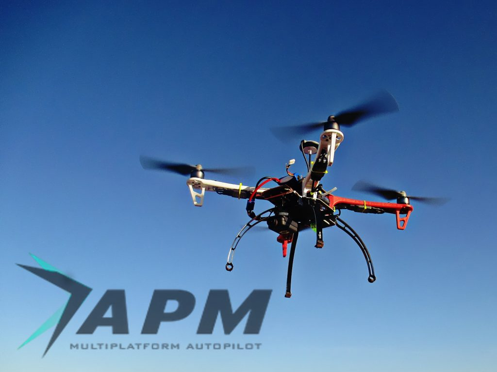

# Drone Development Environment Specification



### **Delopment Environment**



### Building the Code



> #### Qt Creator on Linux <a id="qt-creator-on-linux"></a>
>
> Before starting Qt Creator, the [project file](https://cmake.org/Wiki/CMake_Generator_Specific_Information#Code::Blocks_Generator) needs to be created:
>
> ```text
> cd ~/src/Firmware
> mkdir ../Firmware-build
> cd ../Firmware-build
> cmake ../Firmware -G "CodeBlocks - Unix Makefiles"
> ```
>
> Then load the CMakeLists.txt in the root firmware folder via **File &gt; Open File or Project** \(Select the CMakeLists.txt file\).
>
> After loading, the **play** button can be configured to run the project by selecting 'custom executable' in the run target configuration and entering 'make' as executable and 'upload' as argument.


上記記述箇所に対しての手順追加

QT Creatorに対して、以下の設定手順を追加した上で、Makeを実施しないと、uploadをMakeするルールがないとのエラーが発生する。

1. Qt Creatorを起動
2. Qt Creator画面左側のバーから「プロジェクト」を選択
3. 「プロジェクトを開く」でpx4/firmware直下の"CMakeLists.txt"を選択し、「開く」
4. 「ビルド設定」→ビルドステップの「詳細」をクリック
5. 隠れていた項目が展開されるので、その中の「ターゲット:」から「jmavsim

   」を選択

6. Qt Creator画面左下の「実行」をクリック

[https://seesaawiki.jp/px4/d/qt%A4%C7%A4%CE%A5%D3%A5%EB%A5%C9%A4%C8%BC%C2%B9%D4%28jMAVSim%29](https://seesaawiki.jp/px4/d/qt%A4%C7%A4%CE%A5%D3%A5%EB%A5%C9%A4%C8%BC%C2%B9%D4%28jMAVSim%29)


Javaが起動して3D画面が表示されれば設定は問題なく実施できている。



### Debugging & Logging

gdbおよびlldbを用いたdebugging方法を記載します。




#### QTCreator（IDE）との連携

gdbinitファイルに、以下の記載を追加する。

```text
add-auto-load-safe-path <path>/src/Firmware-build/tmp/rootfs/.gdbinit
```


QT Creatrorから「jmavsim\_\_\_gdb」ビルドオプションを追加する。



ログについて

> warning: File "/home/takuto/shadow-build/tmp/rootfs/.gdbinit" auto-loading has been declined by your \`auto-load safe-path' set to "$debugdir:$datadir/auto-load".
>
> To enable execution of this file add
>
>  add-auto-load-safe-path /home/takuto/shadow-build/tmp/rootfs/.gdbinit
>
> line to your configuration file "/home/takuto/.gdbinit".



#### threadのアタッチを許可するための設定を変更

以下引用

> In Maverick Meerkat \(10.10\) Ubuntu introduced a patch to disallow ptracing of non-child processes by non-root users - ie. only a process which is a parent of another process can ptrace it for normal users - whilst root can still ptrace every process. Hence why you can use gdb to attach via sudo still.
>
> You can temporarily disable this restriction \(and revert to the old behaviour allowing your user to ptrace \(gdb\) any of their other processes\) by doing:
>
> ```text
> echo 0 | sudo tee /proc/sys/kernel/yama/ptrace_scope
> ```
>
> To permanently allow it edit /etc/sysctl.d/10-ptrace.conf and change the line:
>
> ```text
> kernel.yama.ptrace_scope = 1
> ```
>
> To read
>
> ```text
> kernel.yama.ptrace_scope = 0
> ```
>
> For some background on why this change was made, see the [Ubuntu wiki](https://wiki.ubuntu.com/SecurityTeam/Roadmap/KernelHardening#ptrace%20Protection)




VS Code（IDE）を使ったステップ実行について：　未確認



QT（IDE）とDebugging連携について：　未確認



jmavsim\_\_\_debugの記載箇所を参照：未確認




### Gazebo Debugging\(IDE連携\)



> \(IDEコンパイル情報\)
>
> Scanning dependencies of target jmavsim\_\_\_gdb
>
> SITL ARGS
>
> sitl\_bin: /home/takuto/shadow-build/bin/px4
>
> debugger: gdb
>
> program: jmavsim
>
> model: none
>
> src\_path: /home/takuto/shadow
>
> build\_path: /home/takuto/shadow-build
>
> empty model, setting iris as default
>
> SITL COMMAND: "/home/takuto/shadow-build/bin/px4" "/home/takuto/shadow"/ROMFS/px4fmu\_common -s etc/init.d-posix/rcS -t "/home/takuto/shadow"/test\_data
>
> GNU gdb \(Ubuntu 8.1-0ubuntu3\) 8.1.0.20180409-git
>
> Copyright \(C\) 2018 Free Software Foundation, Inc.
>
> License GPLv3+: GNU GPL version 3 or later &lt;http://gnu.org/licenses/gpl.html&gt;
>
> This is free software: you are free to change and redistribute it.
>
> There is NO WARRANTY, to the extent permitted by law. Type "show copying"
>
> and "show warranty" for details.
>
> This GDB was configured as "x86\_64-linux-gnu".
>
> Type "show configuration" for configuration details.
>
> For bug reporting instructions, please see:
>
> &lt;http://www.gnu.org/software/gdb/bugs/&gt;.
>
> Find the GDB manual and other documentation resources online at:
>
> &lt;http://www.gnu.org/software/gdb/documentation/&gt;.
>
> For help, type "help".
>
> Type "apropos word" to search for commands related to "word"...
>
> Reading symbols from /home/takuto/shadow-build/bin/px4...Buildfile: /home/takuto/shadow/Tools/jMAVSim/build.xml
>
> done.
>
> warning: File "/home/takuto/shadow-build/tmp/rootfs/.gdbinit" auto-loading has been declined by your \`auto-load safe-path' set to "$debugdir:$datadir/auto-load".
>
> To enable execution of this file add
>
>  add-auto-load-safe-path /home/takuto/shadow-build/tmp/rootfs/.gdbinit
>
> line to your configuration file "/home/takuto/.gdbinit".
>
> To completely disable this security protection add
>
>  set auto-load safe-path /
>
> line to your configuration file "/home/takuto/.gdbinit".
>
> For more information about this security protection see the
>
> "Auto-loading safe path" section in the GDB manual. E.g., run from the shell:
>
>  info "\(gdb\)Auto-loading safe path"
>
> \(gdb\)
>
> make\_dirs:
>
> compile:
>
> create\_run\_jar:
>
> copy\_res:
>
> BUILD SUCCESSFUL
>
> Total time: 0 seconds
>
> Options parsed, starting Sim.
>
> Starting GUI...

コンパイル情報（参考まで）

> SITL ARGS
>
> sitl\_bin: /home/takuto/src/Firmware-build/bin/px4
>
> debugger: gdb
>
> program: jmavsim
>
> model: none
>
> src\_path: /home/takuto/src/Firmware
>
> build\_path: /home/takuto/src/Firmware-build
>
> empty model, setting iris as default
>
> SITL COMMAND: "/home/takuto/src/Firmware-build/bin/px4" "/home/takuto/src/Firmware"/ROMFS/px4fmu\_common -s etc/init.d-posix/rcS -t "/home/takuto/src/Firmware"/test\_data
>
> GNU gdb \(Ubuntu 7.11.1-0ubuntu1~16.5\) 7.11.1
>
> Copyright \(C\) 2016 Free Software Foundation, Inc.
>
> License GPLv3+: GNU GPL version 3 or later &lt;http://gnu.org/licenses/gpl.html&gt;
>
> This is free software: you are free to change and redistribute it.
>
> There is NO WARRANTY, to the extent permitted by law. Type "show copying"
>
> and "show warranty" for details.
>
> This GDB was configured as "x86\_64-linux-gnu".
>
> Type "show configuration" for configuration details.
>
> For bug reporting instructions, please see:
>
> &lt;http://www.gnu.org/software/gdb/bugs/&gt;.
>
> Find the GDB manual and other documentation resources online at:
>
> &lt;http://www.gnu.org/software/gdb/documentation/&gt;.
>
> For help, type "help".
>
> Type "apropos word" to search for commands related to "word"...
>
> Reading symbols from /home/takuto/src/Firmware-build/bin/px4...Buildfile: /home/takuto/src/Firmware/Tools/jMAVSim/build.xml
>
> done.
>
> warning: File "/home/takuto/src/Firmware-build/tmp/rootfs/.gdbinit" auto-loading has been declined by your \`auto-load safe-path' set to "$debugdir:$datadir/auto-load".
>
> To enable execution of this file add
>
>  add-auto-load-safe-path /home/takuto/src/Firmware-build/tmp/rootfs/.gdbinit
>
> line to your configuration file "/home/takuto/.gdbinit".
>
> To completely disable this security protection add
>
>  set auto-load safe-path /
>
> line to your configuration file "/home/takuto/.gdbinit".
>
> For more information about this security protection see the
>
> "Auto-loading safe path" section in the GDB manual. E.g., run from the shell:
>
>  info "\(gdb\)Auto-loading safe path"




#### IDE Debugging : 未確認






### **SnapDragon Development Environment**







> PX4 ハードウェア構成
>
> 



\*\*\*\*

### **QGroundControl**

#### **Download & Install**



#### **Others**










### **DroneCode**



Dev Guide



User GuideArduPilot




### **Pix4AutoPilot**








### **DroneCode 参考サイト**

> APMはマルチコプターやラジコン飛行機で、オートパイロットを実現するためのプラットフォームです。このプラットフォームは、航空機の機体に設置するフライトコントローラー（フラコン）に搭載するための「ファームウェア」、パソコンやタブレットなど地上側の端末から機体を操作するグラウンドコントロールステーション（Ground Control Station : GCS）の役割を果たす「ソフトウェア」、そして機体に搭載するフライトコントローラーである「ハードウェア」から構成されています。
>
> APMはさらに上位の開発プロジェクト「ドローンコード（Dronecode）」の一部でもあります。Dronecodeはオープンソースのドローン開発向けプラットフォームであり、世界中の企業が協力して、ドローン開発のデファクトスタンダードを作ろうとしています。以下でその内容を詳しく説明しています。










\*\*\*\*


