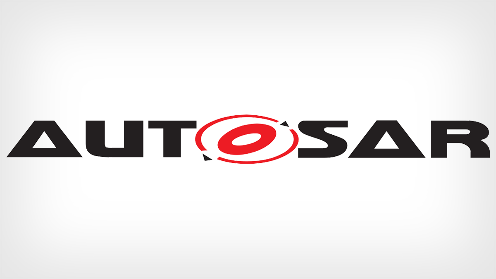

# AUTOSAR Adaptive Platform

### AUTOSAR Adaptive Platform Specification



### 

### Adaptive Platform Architecture



### サマリ



（上記サイトの引用）

> POSIXオペレーティングシステムに基づく新たな標準規格、「AUTOSAR Adaptive Platform」が、AUTOSAR開発パートナーシップのラインナップに追加されます。
>
> AUTOSAR Adaptive Platformは、車載ECUのための将来性を考慮した基盤です。この新しい標準規格には主に、分散型のワークグループに属するECUを相互に独立して開発できるという利点があります。
>
> 従来型のECU開発は、厳格なリアルタイム性と安全要求を主軸として進められてきました。しかし、今日特に重視されるのは更新やアップグレードなど の機能面です。そしてこれには、ソフトウェアコンポーネントの動的なリロード、画像解析などへの標準ライブラリーの使用、機能の自己学習、量産サイクルの 高速化が必要になります。
>
> これまでのAUTOSAR仕様は、[AUTOSAR Classic Platform](https://www.vector.com/jp/ja/know-how/technologies/autosar/autosar-classic/) という名称で存続されます。
>
> ### Vector Congress 2016での講演
>
> 2016年11月29、30日の2日間、ベクターコングレスがシュツットガルト（ドイツ）で開催されました。カーエレクトロニクスの業界関係者が交流するこのイベントも今回で8回目を迎え、会場の「Alte Stuttgarter Reithalle」には、ベクター取締役会の招待を受けた350名を超えるゲストが世界中から集まりました。
>
> **プレゼンテーション: 将来のユースケースに対応するAUTOSAR Adaptive Platform**
>
> 講演者: Patrick Markl（ベクター）
>
> * AUTOSAR Adaptive Platform
> * サービス指向通信
>
> [プレゼンテーションを見る（英語版PDF）](https://assets.vector.com/cms/content/know-how/AUTOSAR%20Adaptive/Slides/VeCo16_24_30Nov_Reithalle_Markl_Vector.pdf)
>
> [動画を見る（YouTube、英語版）](https://www.youtube.com/watch?v=AphhVN5tbzw)
>
> ### オブジェクト指向による新しいユースケースへの対応
>
> オブジェクト指向によるAUTOSAR Adaptive Platformのアプローチは、自動運転アルゴリズムなどの、データ量が大きい演算集約型のタスクにとって最適な基盤となります。
>
> この新しいAUTOSAR仕様には、主に以下のようなユースケースがあります。
>
> * 自動運転
> * 車両と周辺の他車両および交通インフラとのネットワーキング（V2X）
> * マルチメディアアプリケーション（音楽ストリーミング、オンラインナビゲーションなど）
> * 無線方式によるアプリケーションの継続的な更新
>
> AUTOSAR Adaptive Platformには、車載ECUのアーキテクチャーのための、さらに柔軟性の高いオプションが用意されています。ドメインコントローラーによって、機能 をセンサー／アクチュエーターレベルから切り離し、中央処理ができるようになるのです。これによってアプリケーション開発時に、個々のECUへの最終的な 機能分配をあらかじめ定義しておく必要がなくなります。
>
> ### 新しいAUTOSAR Adaptive Platformとの互換性
>
> 今後、従来のアプリケーションのセンサーやアクチュエーターは既存のAUTOSAR Classic Platform内に引き続いて実装されることになりますが、これらには新しいAUTOSAR Adaptive Platformとの完全な互換性があります。
>
> これまでのアプローチでは、車両内の各ECUは全体のシステムに静的に統合されていたため、接続の関係はコンフィギュレーション時に定義しなければならず、実行時に加えることのできる変更は極めて限られていました。
>
> ### サービス指向通信
>
> AUTOSAR Adaptive Platformに基づくアプリケーション（「Adaptiveアプリケーション」）には決定的な利点があります。それは、これらのアプリケーションで は、システムへの統合を実行時に行うことが可能であるという点です。つまり、それらの開発、テスト、分配、更新は、相互に独立して実施できるのです。
>
> また、サービス指向通信によっても、アプリケーションを任意のタイミングで全体のシステムに統合することが可能になります。これはAUTOSAR Classic PlatformのSOME/IP \(SD\) と互換性があります。
>
> ### POSIXベース
>
> POSIX \(Portable Operating System Interface\) は、アプリケーションとオペレーティングシステムの間に介在する標準化されたプログラミングインターフェイスですが、もともと自動車業界向けに開発された ものではありません。ただし、POSIXオペレーティングシステムを使用すれば、自動車用ソフトウェア開発の柔軟性が大幅に向上します。
>
> 新しく定義された「AUTOSAR Runtime Environment for Adaptive Applications \(ARA\)」インターフェイスとPOSIXサブセットの「PSE51」のみを使用するAdaptiveアプリケーションは、可搬性が高いアプリケーション であるといえます。POSIXのアプローチにより、ユーザーはこれらのアプリケーションを、任意の方法で既存のECUに分配できます。
>
> ### リリースプラン
>
> * AUTOSAR Adaptive Platformの最初のリリースは2017年3月に公開されました
> * この初期リリースで予定されていた機能は以下のとおりです
>   * システム始動およびアプリケーションの実行
>   * サービス指向通信により、アプリケーションが相互にメッセージを共有することができる
>   * システムは診断サービスを通じて、アプリケーションからのエラーメッセージの読出し、改変操作、エラーメッセージへの対応を行うことができる
> * AUTOSAR Adaptive Platformの開発は、6か月から9か月のリリース周期で進められる予定です

