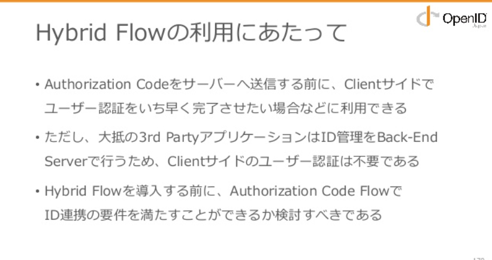

# AWSサービス



### 

### AWS SAM Local



（上記サイトの日本語訳を引用）

> ## AWS SAM（ベータ版）
>
>  
>
> AWSサーバーレスアプリケーションモデル（SAM）は、サーバーレスアプリケーションを構築するためのオープンソースフレームワークです。関数、API、データベース、およびイベントソースマッピングを表現するための簡略構文を提供します。ほんの数行の構成で、必要なアプリケーションを定義し、それをモデル化することができます。
>
> 
>
> ### はじめに
>
> SAMベースのアプリケーションの構築を始めるには、SAM CLIを使用してください。SAM CLIは、SAMテンプレートで定義されたアプリケーションをローカルに構築、テスト、デバッグ、およびデプロイできる、Lambda風の実行環境を提供します。
>
> * [SAM CLIをインストールする](https://docs.aws.amazon.com/serverless-application-model/latest/developerguide/serverless-sam-cli-install.html)
> * [「Hello World」Webアプリケーションを構築してデプロイする](https://docs.aws.amazon.com/serverless-application-model/latest/developerguide/serverless-quick-start.html)
> * SAMをお気に入りのIDEで使用するには[AWS Toolkit](https://aws.amazon.com/getting-started/tools-sdks/#IDE_and_IDE_Toolkits)を[インストール](https://aws.amazon.com/getting-started/tools-sdks/#IDE_and_IDE_Toolkits)してください。
>
> **次のステップ：**より複雑なサーバーレスアプリケーションを構築する方法を学びましょう。
>
> * Amazon S3およびAmazon Rekognitionサービスを使用[して画像からテキストを抽出し、データベースに保存し](https://docs.aws.amazon.com/serverless-application-model/latest/developerguide/serverless-example-s3.html)ます。
> * Amazon DynamoDBデータベースと非同期ストリーム処理を使用[して、レコードがいつデータベースに追加されたかを検出し](https://docs.aws.amazon.com/serverless-application-model/latest/developerguide/serverless-example-ddb.html)ます。
>
> **詳細な参考資料：** SAMコマンドと使用法について**詳しく**説明します。
>
> * [CLIコマンド](https://docs.aws.amazon.com/serverless-application-model/latest/developerguide/serverless-sam-cli-command-reference.html)
> * [SAMテンプレートの仕様](https://github.com/awslabs/serverless-application-model/blob/master/versions/2016-10-31.md)
> * [ポリシーテンプレート](https://docs.aws.amazon.com/serverless-application-model/latest/developerguide/serverless-policy-templates.html)
>
> ### なぜSAMなのか
>
> * **シングル配置構成**。SAMを使用すると、関連するコンポーネントやリソースを簡単に整理し、単一のスタックで操作することができます。SAMを使用して、リソース間で設定（メモリやタイムアウトなど）を共有したり、関連するすべてのリソースを単一のバージョン付きエンティティとしてまとめて展開したりできます。
> * **ローカルデバッグおよびテスト**。SAM CLIを使用して、Lambda風の実行環境でSAMアプリケーションをローカルに構築、テスト、およびデバッグします。クラウドにデプロイした後でなければ識別できないような問題をローカルで見つけてトラブルシューティングするのを手助けすることで、開発ループを強化します。
> * **開発ツールとの緊密な統合**。あなたはあなたが愛して使うツール一式と一緒にSAMを使うことができます。
>   * IDE：[PyCharm](https://aws.amazon.com/pycharm/)、[IntelliJ](https://aws.amazon.com/intellij/)、[Visual Studioコード](https://aws.amazon.com/visualstudiocode/)、[Visual Studio](https://aws.amazon.com/visualstudio/)、[AWS Cloud9](https://aws.amazon.com/cloud9/)
>   * ビルド：[CodeBuild](https://docs.aws.amazon.com/codebuild/latest/userguide/)
>   * デプロイ：[CodeDeploy](https://docs.aws.amazon.com/codedeploy/latest/userguide/)、[Jenkins](https://wiki.jenkins.io/display/JENKINS/AWS+SAM+Plugin)
>   * 連続配信パイプライン：[CodePipeline](https://docs.aws.amazon.com/codepipeline/latest/userguide/)
>   * サーバーレスアプリケーションとパターンの発見：[AWSサーバーレスアプリケーションリポジトリ](https://docs.aws.amazon.com/serverlessrepo/latest/devguide/)
> * **組み込みのベストプラクティス**。SAMを使用して、インフラストラクチャを構成として定義および展開できます。これにより、コードレビューを通じてベストプラクティスを使用して実施することが可能になります。また、数行の設定で、CodeDeployを使用して安全なデプロイを有効にし、AWS X-Rayを使用してトレースを有効にすることができます。
> * **AWS CloudFormationの拡張**。SAMはAWS CloudFormationの拡張であるため、AWS CloudFormationの信頼性の高いデプロイ機能を手に入れることができます。SAMテンプレートでCloudFormationを使用してリソースを定義できます。また、CloudFormationで利用可能なリソース、組み込み関数、およびその他のテンプレート機能のフルスイートを使用することもできます。
>
> ### このGithubリポジトリとは何ですか？ 
>
> このGithubリポジトリには、SAM CLIのソースコードが含まれています。開発チームはこのコードについて話しています。
>
> > SAM CLIコードはPythonで書かれています。ソースコードはよく文書化されており、非常にモジュール化されており、95％の単体テストカバレッジを持っています。Clickと呼ばれるこの素晴らしいPythonライブラリを使ってコマンドラインのやりとりを管理し、Dockerを使ってLambda関数をローカルで実行します。私たちはあなたがコードベースを好きになると思います。クローンを作成して実行して`make pr`ください。
>
> ### SAMに貢献する
>
> 私達は私達の貢献者を愛している 私たちは製品のさまざまな部分を構築した100人以上の貢献者を持っています。SAMへの貢献についての詳細は[、@ndobryanskyyからの紹介文](https://www.lohika.com/aws-sam-my-exciting-first-open-source-experience/)を[ご覧](https://www.lohika.com/aws-sam-my-exciting-first-open-source-experience/)ください。
>
> 興味とスキルに応じて、SAMプロジェクトのさまざまな部分を構築するのに役立ちます。
>
> **SAM仕様を拡張する**
>
> 完全なSAMテンプレート仕様を改善するために、プルリクエストを行い、バグを報告し、アイデアを共有してください。ソースコードはGithubの[awslabs / serverless-application-modelにあり](https://github.com/awslabs/serverless-application-model)ます。 開始するには[SAM Specification Contribution Guide](https://github.com/awslabs/serverless-application-model/blob/master/CONTRIBUTING.md)を読んでください。
>
> **SAM CLIを強化する**
>
> 新しいコマンドを追加したり、既存のコマンドを拡張したり、バグを報告したり、SAM CLIの新しい機能を要求したりします。ソースコードはGithubの[awslabs / aws-sam-cliにあり](https://github.com/awslabs/aws-sam-cli)ます。[SAM CLI貢献ガイド](https://github.com/awslabs/aws-sam-cli/blob/develop/CONTRIBUTING.md)を読んで始めましょう。
>
> **SAM開発者ガイドの更新**
>
> [SAM開発者ガイド](https://docs.aws.amazon.com/serverless-application-model/latest/developerguide/index.html)は包括的な入門ガイドとリファレンスドキュメントを提供します。ソースコードはGithubの[awsdocs / aws-sam-developer-guideにあり](https://github.com/awsdocs/aws-sam-developer-guide)ます。開始するには[SAM Documentation Contribution Guide](https://github.com/awsdocs/aws-sam-developer-guide/blob/master/CONTRIBUTING.md)を読んでください。
>
> #### SlackでSAMコミュニティに参加しよう
>
> Slack [のSAM開発者チャンネル（\#samdev）](https://join.slack.com/t/awsdevelopers/shared_invite/enQtMzg3NTc5OTM2MzcxLTdjYTdhYWE3OTQyYTU4Njk1ZWY4Y2ZjYjBhMTUxNGYzNDg5MWQ1ZTc5MTRlOGY0OTI4NTdlZTMwNmI5YTgwOGM/)に[参加して、](https://join.slack.com/t/awsdevelopers/shared_invite/enQtMzg3NTc5OTM2MzcxLTdjYTdhYWE3OTQyYTU4Njk1ZWY4Y2ZjYjBhMTUxNGYzNDg5MWQ1ZTc5MTRlOGY0OTI4NTdlZTMwNmI5YTgwOGM/)他のコミュニティメンバーやAWS SAMチームとコラボレーションし[ましょう](https://join.slack.com/t/awsdevelopers/shared_invite/enQtMzg3NTc5OTM2MzcxLTdjYTdhYWE3OTQyYTU4Njk1ZWY4Y2ZjYjBhMTUxNGYzNDg5MWQ1ZTc5MTRlOGY0OTI4NTdlZTMwNmI5YTgwOGM/)。


SAMは、AWS Serverless Application Modelの略語


### Amazon CloudFront



### Amazon Route 53



> ### Amazon Route 53 の機能 
>
> Amazon Route 53 は、数分で開始できる、シンプルなウェブサービスインターフェイスです。[DNS](https://aws.amazon.com/route53/what-is-dns/) レコードは、Route 53 の API で設定する "ホストゾーン" にまとめられます。Route 53 を使うには、以下を行います。
>
> * このページの \[登録\] ボタンをクリックしてサービスに申し込みます。
> * ドメインの DNS レコードを格納できるホストゾーンを作成します。ホストゾーンが作成されると、高水準の可用性を実現するために、4 つの異なるトップレベルドメイン \(TLD\) で 4 つの Route 53 のネームサーバーを受信します。ドメイン名がない場合、利用できるドメインを検索し、Route 53 コンソールを使用してそれを登録できます。既存のドメイン名がある場合、1 か所でドメイン名と DNS 構成を管理できるように、そのドメイン名を Route 53 の管理に転送することもできます。 
> * ホストゾーンにはまず、ドメインのクエリに返答する 4 つのバーチャルネームサーバーを含め、DNS レコードの基本セットのデータが読み込まれます。AWS マネジメントコンソールを使用して、または ChangeResourceRecordSet API を呼び出して、このセットのレコードを追加、削除、または変更することができます。サポートされる DNS レコードのリストは、[こちら](https://aws.amazon.com/route53/faqs/#Supported_DNS_record_types)をご覧ください。
> * 現在のレジストラでドメイン名を保持する場合、ドメインのネームサーバーをホストゾーンに関連付けられたネームサーバーに更新するようにレジストラに通知します。Route 53 でドメイン名を登録している場合、ドメイン名は自動的に正しいネームサーバーに関連付けられます。 
>
> ドメイン名を別の DNS サービスから Route 53 に転送するには、以下を行います。
>
> * ドメイン名の DNS レコードデータのリストを取得します。これは一般に、既存の DNS プロバイダーから取得可能な "ゾーンファイル" のフォーマットです。
> * 前述の 4 つの開始手順に従います。
>
> 以下のいくつかの簡単なステップに従えば、数分で DNS エントリを設定し、Route 53 にウェブアプリケーションのクエリに応答させることができます。Route 53 サービスと API の詳細情報については、アマゾンの技術文書を参照してください。

#### Multi-Region対応



（上記サイトの日本語訳を記載）

> ## AWSで利用可能になったマルチリージョンレイテンシーベースのルーティング
>
> [ジェフ・バール](https://aws.amazon.com/blogs/aws/author/jbarr/) \| に 2012年3月21日\| [パーマリンク](https://aws.amazon.com/blogs/aws/latency-based-multi-region-routing-now-available-for-aws/) \| [ シェア](https://aws.amazon.com/jp/blogs/aws/latency-based-multi-region-routing-now-available-for-aws/#)
>
> アマゾンウェブサービスは、今も増え続ける[一連の地域で](http://aws.amazon.com/about-aws/globalinfrastructure/)利用可能です。複数のAWSリージョンにまたがるアプリケーションをより簡単に構築できるようにしてください。
>
> 本日、[Amazon Route 53](http://aws.amazon.com/route53/)が、[Amazon CloudFront](http://aws.amazon.com/cloudfront/)   を[Amazon EC2](http://aws.amazon.com/ec2/)、[Elastic Load Balancing](http://aws.amazon.com/elasticloadbalancing/)などのユーザーに提供するのと同じレイテンシベースのルーティングテクノロジを提供することを発表しました。Amazon Route 53の新しいLatency Based Routing（LBR）機能を使用して、複数のAWSリージョンにインスタンスを作成し、エンドユーザーからのリクエストを最も低いレイテンシーで自動的にそのリージョンにルーティングすることができます。
>
> **Amazon Route 53を**  
> 使用**したレイテンシーベースのレコードセットの設定Amazon Route 53で**ホストされているDNSレコードセットは、Route 53 APIと[ AWSマネジメントコンソールの\[Route 53\]タブの](https://console.aws.amazon.com/route53/home)両方でレイテンシーベースとしてマークできるようになりました。Route 53コンソールでEC2インスタンスのパブリックIP、Elastic IP、またはElastic Load Balancerターゲットを入力した場合は、正しい地域が推奨されます。
>
> 名前とタイプが一致する2つ以上のレイテンシベースのレコードセットを設定すると、Route 53ネームサーバはネットワークレイテンシとDNSテレメトリを使用して、特定のクエリに対して返す最適なレコードセットを選択します。
>
> 舞台裏では、私たちは常に匿名のインターネット待ち時間測定値を収集し、それら  を処理のために多くの[リレーショナルデータベースサービス](http://aws.amazon.com/rds/)インスタンスに保存しています。これらの測定値は、各AWSリージョンからそこにあるほぼすべてのインターネットネットワークまでのネットワーク遅延の比較表を作成するのに役立ちます。それらはまた私達がそれらのエンドユーザーが一般的に使用するDNSリゾルバーを決定することを可能にします。
>
> Latency Based Routingは、 "A"、 "AAAA"、 "CNAME"、 "TXT" DNSレコードタイプ、およびRoute 53固有の "ALIAS to A"および "ALIAS to AAAA"レコードタイプで使用できます。
>
> **価格**  
> 1か月の最初の10億件のクエリに対して100万件のクエリにつき0.75ドル、特定の月のすべての追加クエリに対して100万件のクエリにつき0.375ドルのLatency Based Routing価格設定を導入しています。レイテンシベースのElastic Load Balancer「ALIAS」レコードセットに対するクエリは無料です。
>
> **レイテンシーベースのルーティングへのスムーズな移行**  
> 今日、Amazon Route 53の他の機能のロックも解除されています。独自のRoute 53ホストゾーン内のリソースレコードセットを指す「ALIAS」レコードを作成できるようになりました。これらのALIASレコードはデシジョンツリー内でポインタまたは矢印として機能し、待ち時間ベースのレコードセット、加重レコードセット、およびマルチレコードレコードセットを作成して高度なまたは複雑なルーティングシナリオに対処することを可能にします。
>
> 重み付きリソースレコードセットとエイリアスをレイテンシベースのレコードセットに組み合わせることで、レイテンシベースのルーティングを最初に使用する頻度を決定する簡単な「ダイヤル」を設定できます。小さな割合から始めてその割合を徐々に増やすことで、地域の過負荷やユーザーエクスペリエンスの低下のリスクを最小限に抑えることができます。
>
> たとえば、AWS US East（Northern Virginia）リージョンのインスタンスを持つ単一リージョン設定から、US East（Northern Virginia）とEU（Ireland）の両方のインスタンスを持つレイテンシベースのルーティング設定に移行する場合、次のように設定します。次の図のような決定木を形成する一連のレコードセット。
>
> このような構成では、DNSクエリの約99％が待ち時間ベースのルーティングの影響を受けず、ユーザーは米国東部（Northern Virginia）の回答（192.0.2.1）に誘導されます。他の1％のルート53は、ネットワークの待ち時間に基づいてユーザーの送信先を選択します。一部のユーザーはeu-west-1に転送され、一部のユーザーはus-east-1に転送されます。リクエストの発信元と2つのAWSリージョン。次第に、これらのパーセンテージは変更される可能性があり、時間が経つにつれて完全なレイテンシベースの決定プロセスに移行する可能性があります。
>
> **レイテンシベースのルーティングと加重ラウンドロビンレコードセットの**  
> 組み合わせレイテンシベースのレコードセットと加重ラウンドロビンレコードセットを逆の順序で組み合わせることもできます。たとえば、加重ラウンドロビンDNSを使用して、同じリージョン内の複数のインスタンスに負荷を分散させることができます。
>
> 次の例では、Route 53は最初にレイテンシーベースのルーティングを使用してユーザーを誘導する地域を決定し、次にEU（ダブリン）地域が選択されている場合は半分の重み付きラウンドロビンポリシーを適用するように設定できます。答えは192.0.2.127を返し、残りの半分は192.0.2.128を返します。
>
> **ボーナススケーリング機能：100以上のレコードセットとマルチレコードアンサーの重み付け**  
> Amazon Route 53は、多くの大規模Webプレゼンスで使用されており、お客様からのフィードバックに応えて、さらに大きなセットに対しても重み付けラウンドロビンDNSを有効にしています。答えの これまで、重み付けされたリソースレコードセットはそれぞれ100レコードセットに制限されていました。各レコードセットはそれぞれ1レコード（IPアドレスなど）だけです。
>
> まず、加重「エイリアス」レコードセットは、それ自体が加重「エイリアス」レコードセットの有効なターゲットにもなります。これにより、エイリアスの再帰的加重木を作成することができます。最大3レベルの再帰を許可し、DNS名ごとに最大100万の個別の加重レコードセットを許可します。
>
> 次に、百を超えるレコードに重みを付けるもう1つの方法は、それぞれ複数のレコードを含むレコードセットを作成することです。たとえば、サービスをホストしている20個のElastic IPがある場合、それぞれが4つのIPアドレスを含む5つのレコードセットを作成すると便利です。DNSクライアントが再試行をサポートしている場合は、各レコードセットに異なるアベイラビリティゾーンからのレコードが混在していることを確認すると特に便利です。このようにして、アベイラビリティーゾーンが利用できないときに代替案がクライアントに利用可能です。
>
> これらの種類のマルチレコードレコードセットは、再度「ALIAS」レコードを使用することで、加重ラウンドロビンDNSで使用できるようになりました。マルチレコードレコードセットは、加重エイリアスのターゲットとして完全に有効です。
>
> [Route 53のドキュメント](http://aws.amazon.com/documentation/route53/)で、Latency Based Routing、エイリアス、WRRについてさらに学ぶことができ[ます](http://aws.amazon.com/documentation/route53/)。
>
> ビジネスやアプリケーションで新しいLatency Based Routing機能をどのように使用できるかについて、非常に関心があります。少し時間をかけて、この1質問の[Route 53調査](http://aws.qualtrics.com/SE/?SID=SV_aVGDyJrK0H2dy0k)についてご意見をお寄せください。
>
> Amazon Route 53とLatency Based Routing機能の詳細については、[Route 53ウェビナー](https://www2.gotomeeting.com/register/546920178)（4月26日の午前10時（PST））に登録してください。

