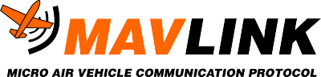

# Mavlink

### MAVLink Introduction

> MAVLinkはドローンと（そしてオンボードドローンコンポーネント間で）通信するための非常に軽量のメッセージングプロトコルです。
>
> MAVLinkは最新のハイブリッドパブリッシュ - サブスクライブとポイントツーポイントのデザインパターンに従います。データストリームは**トピック**として送信/パブリッシュされ、[ミッションプロトコル](https://mavlink.io/en/services/mission.html)や[パラメータプロトコル](https://mavlink.io/en/services/parameter.html)などの設定サブ[プロトコル](https://mavlink.io/en/services/parameter.html)はポイントツーポイントで再送信されます。
>
> メッセージは[XMLファイル内で定義されています](https://mavlink.io/en/messages/)。各XMLファイルは、「方言」とも呼ばれる、特定のMAVLinkシステムによってサポートされるメッセージセットを定義します。_ほとんどの_地上管制局や自動操縦装置によって実行される参照メッセージセットは[common.xml](https://mavlink.io/en/messages/common.html)で定義されてい[ます](https://mavlink.io/en/messages/common.html)（ほとんどの方言_は_この定義の_上に構築され_ています）。
>
> [MAVLinkツールチェーンを](https://github.com/mavlink/mavlink/)するためにXMLメッセージの定義を使用して[生成する](https://mavlink.io/en/getting_started/generate_libraries.html)ごとにMAVLinkライブラリを[サポートされているプログラミング言語](https://mavlink.io/en/#supported_languages)。無人偵察機、地上管制局、およびその他のMAVLinkシステムは、生成されたライブラリを使用して通信します。これらは通常MITライセンスされているため、クローズドソースアプリケーションのソースコードを公開しなくても、クローズドソースアプリケーションで制限なく_使用_できます。



### MAVLink Messages Specification



### Telemetry Wifi



### Mavlinkプロトコル



### 参考サイト



